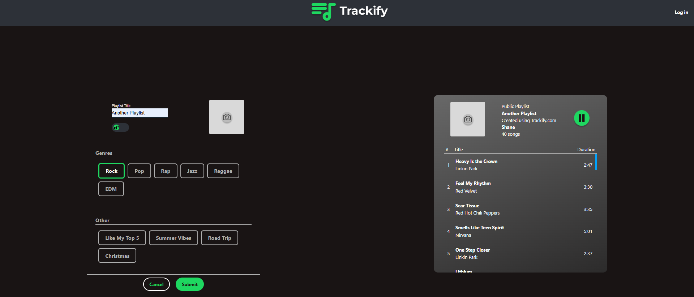

# Technologies

<p align="center">
  
  
  
  
</p>

--- 


# Overview

Trackify is a fullstack React (Vite) website that allows users to create playlists based on genre.
Each Playlist is tailored to the user who creates them as all songs are taken from their "Recommended" songs.

---


# User Interface

<p align="center">
  
</p>

---


# Technologies

### Frontend
<ul>
  <li>React</li>
  <li>Vite</li>
  <li>Material UI</li>
  <li>Tailwind</li>
  <li>Flex Box</li>
</ul>


### Backend
<ul>
  <li>Node.js</li>
  <li>Express</li>
  <li>Spotify API</li>
</ul>


---

# Project Structure

```
website/
|-- server/ # Backend (Node.js + Express)
|   |-- .env # Spotify credentials (excluded from repo)
|   |-- server.js # Entry point
|   |-- ... # Routes, controllers, etc. 
|
| -- trackify/ # Frontend (React + Vite)
|   |-- src/
|   |-- components/ # Reusable UI components
|   |-- images/ # Images for buttons and Navbars etc.
|   |-- stylesheets/ # Stylesheets for each individual component
| -- App.jsx # Main app component -- vite.config.js # Vite configuration
```


---

# Environment Variables

The '/server' folder contains a '.env' file with the Spotify API credentials.
This has been **excluded from version control** via '.gitignore'.

The .env file structure is as follows:

```
SPOTIFY_CLIENT_ID=""
SPOTIFY_CLIENT_SECRET=""
SPOTIFY_REDIRECT_URI={REDIRECT URI TO BACKEND TO REQUEST ACCESS TOKEN}
FRONTEND_URI={URI OF FRONTEND PAGE}

```


---

# Setup


